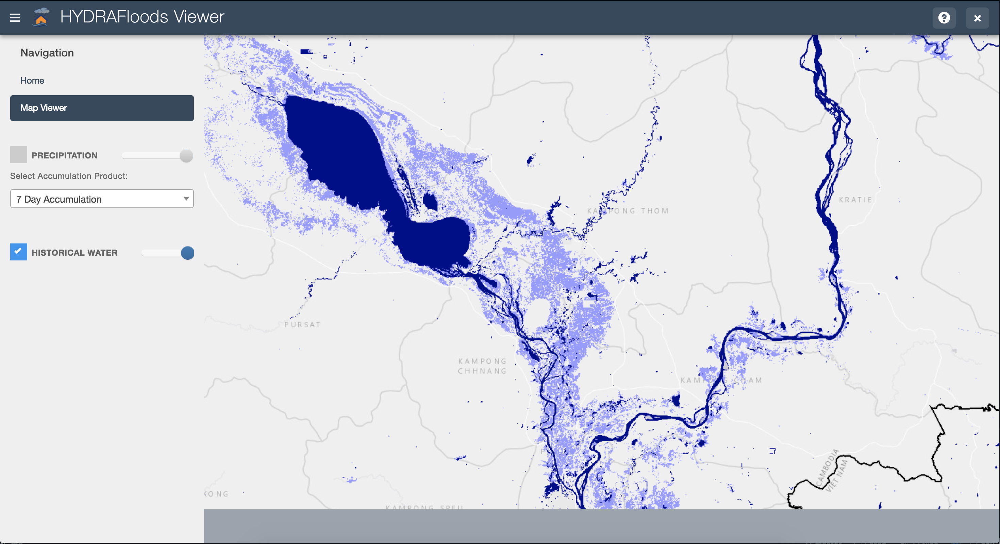

# HYDRAFloods Viewer

The HYDRAFloods Viewer is a web application used to view flood map results from the [HYDRAFloods](https://github.com/servir-mekong/hydra-floods) processing package along with additional hydrologic variables.



### Getting started
The HYDRAFloods viewer is a web application built using the [Tethys Platform](https://tethysplatfom.org), so first off you will need to [install Tethys](http://docs.tethysplatform.org/en/stable/installation.html).

Once you have the Tethys platform installed, you will need to start the Tethys environment...

```
$ . activate tethys
(tethys) $
```

... and install the dependencies for the HYDRAFloods Viewer (`rastersmith` and `hydrafloods`) and their dependencies (`gdal`,`cartopy`,`pillow`,`xarray`, and) to run the application:

```
(tethys) $ conda install -c conda-forge gdal
(tethys) $ conda install -c conda-forge cartopy
(tethys) $ conda install -c conda-forge pillow
(tethys) $ conda install -c conda-forge xarray

(tethys) $ pip install rastersmith
(tethys) $ pip install hydrafloods
```

Furthermore, the Earth Engine Python API needs to be installed and authenticated to access historical water maps:

```
(tethys) $ pip install google-api-python-client
(tethys) $ pip install earthengine-api
(tethys) $ pip install --upgrade oauth2client

(tethys) $ earthengine authenticate
```

Next, clone the HYDRAFloods Viewwer repository from GitHub:

```
(tethys) $ git clone https://github.com/servir-mekong/tethysapp-hydraviewer.git
```

Change directories into the cloned repo and install the application for development:

```
(tethys) $ cd tethysapp-hydraviewer/
(tethys) $ python setup.py develop
```

Now, the HYDRAFloods Viewer is installed and your users can access the most recent flood maps from satellite imagery.
